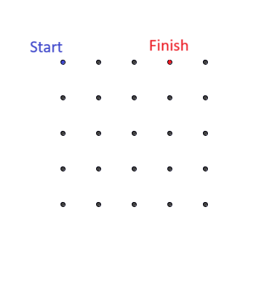
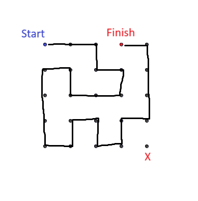

# Grid Solver

> Given an n by m grid of vertices, draw a line between the vertices starting at a vertex `v` and finishing at another vertex `w`, visiting each exactly once.

## About

This utility implements algorithms for the existence & construction of a Hamiltonian path in an arbitrary grid graph.

For more details, see:
- [Problem specification](doc/problem-specification.md): A more informal, intuitive look at the problem
- [_Hamilton Paths in Grid Graphs_](https://www.researchgate.net/publication/220616693_Hamilton_Paths_in_Grid_Graphs): The paper which originally formalized, generalized, and explored the problem

### Motivation

At a recent IBM potluck, employees were presented with the following toy problem - draw a straight line through all points in the below grid starting at the start point and ending at the end point.

These instructions were vague as they did not explicitly state the validity of certain moves.  Solutions were found both involving moving diagonally between points, and leaving the grid.  However, these were both considered "exceptions"; the ideal solution would only utilize moves contained within the graph between immediately adjacent points in the right, left, up, and down directions.  However, no such solution could be found by participants.

I set off to write a program that would solve any general grid problem like this one.  In the process, I discovered that the problem had been formalized and thoroughly explored in [_Hamilton Paths in Grid Graphs_](https://www.researchgate.net/publication/220616693_Hamilton_Paths_in_Grid_Graphs).  I then decided to implement the algorithms described in this paper, and to communicate the results discussed in the paper (which I think are quite interesting) in this repository.