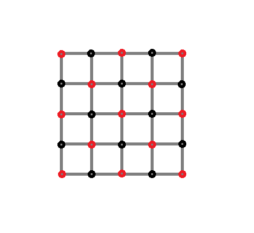
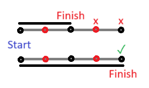
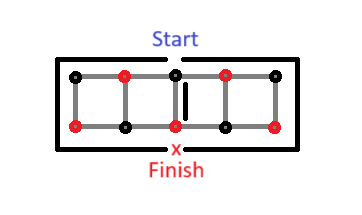
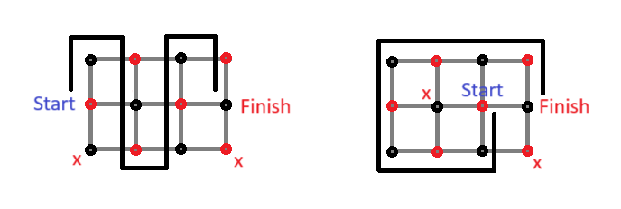
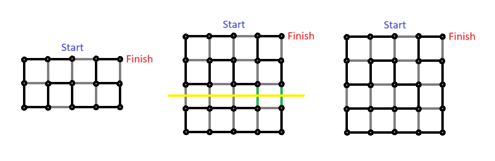
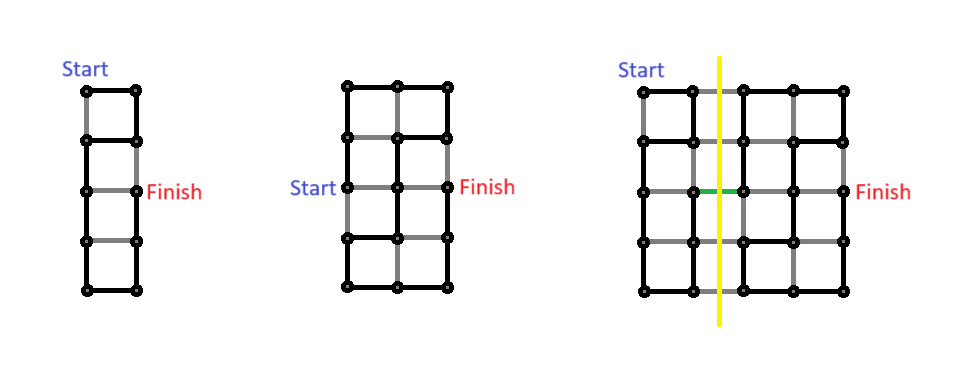
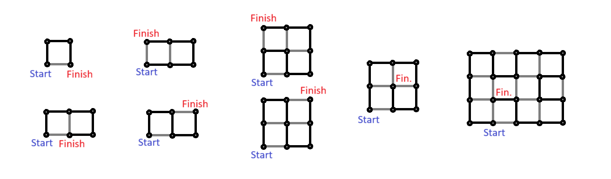

<!-- omit in toc -->
# Problem Specification

The following is a specification of the problem addressed by this solution.

<!-- omit in toc -->
## Contents

- [Overview](#overview)
- [Acceptable Hamiltonian Path Problems](#acceptable-hamiltonian-path-problems)
  - [Color compatibility](#color-compatibility)
  - [Forbidden Hamiltonian Path Problems](#forbidden-hamiltonian-path-problems)
  - [Proving the Necessary Condition](#proving-the-necessary-condition)
- [Stripping, Splitting, and Prime Problems](#stripping-splitting-and-prime-problems)
  - [Stripping](#stripping)
  - [Splitting](#splitting)
  - [Prime Hamiltonian Path Problems](#prime-hamiltonian-path-problems)
  - [Proving the Sufficient Condition](#proving-the-sufficient-condition)
  - [Existence and Construction Algorithms](#existence-and-construction-algorithms)
- [Bibliography](#bibliography)

## Overview

The following is an example of a grid graph, `G(5, 5)`.  We are particularly interested in grid graphs as a key component of this problem as it restricts our allowed movements to the adjacent nodes in the up, down, right, and left direction.

The problem can be formalized as follows.  Given a finite rectangular grid graph `G(n, m)`,
1. Determine whether there exists a Hamiltonian path between two vertices `v`, `w`
2. Construct a Hamiltonian path between `v` and `w` if such a path exists

We denote this problem as `H(G(n, m), v, w)`.  Here, `n` and `m` denote the dimensions of the grid graph (rows and columns respectively), and uniquely define a grid graph up to isomorphism.  The vertex `v` is the start vertex, while `w` is the end vertex.  We note that `v` and `w` need not be given in any particular order as we assume `G(n, m)` to be undirected.

Necessary and sufficient conditions for the existence of a Hamiltonian path over a general grid graph `G(n, m)` are identified in [_Hamilton Paths in Grid Graphs_](https://www.researchgate.net/publication/220616693_Hamilton_Paths_in_Grid_Graphs).  Linear time algorithms for both the existence and construction of a Hamiltonian path are also given.  They are described in relatively informal detail here for the reader's intuition.

## Acceptable Hamiltonian Path Problems

Below are the key definitions and theorems underlying this section.  As seen below, the notions of color-compatibility and forbiddenness culminate in a necessary condition for the existence of a Hamiltonian path over a grid graph `G(n, m)`.

**Definition** A Hamiltonian path problem `H(G(n, m), v, w)` is **acceptable** if vertices `v` and `w` are **color compatible** and the Hamiltonian path problem `H(G(n, m), v, w)` is not **forbidden**.

**Theorem** If there exists a Hamiltonian path in the grid graph `G(n, m)` between vertices `v` and `w` then the Hamiltonian path problem `H(G(n, m), v, w)` is **acceptable**.

### Color compatibility

It is clear that any grid graph `G(n, m)` is 2-colorable, or equivalently, **Bipartite**.  This can be seen by simply coloring the grid graph like a chess board.  So we may denote `G(n, m) = B(V1 U V2, E)` where `V1` and `V2` are edge-disjoint vertex sets.

It is also clear that the cardinality of the vertex sets `V1` and `V2` differ by no more than 1.  That is, without loss of generality, either `|V1| = |V2|` or `|V1| = |V2| + 1`.  This can again be understood by coloring the grid graph like a chess board.  The colors are placed in alternating fashion for each row and column.  Either the total number of vertices in the graph is odd, in which case there is one leftover vertex which must be colored.  Otherwise, there is an equal number of vertices in each color-subset.

Given these two facts, we can understand color compatibility.

**Definition** Two vertices `v, w` belonging to `G(n, m) = B(V1 U V2, E)` are color-compatible if
1. `|V1| = |V2|` and `v` and `w` differ in color
2. `|V1| = |V2| + 1` and `v` and `w` belong to `V1` (that is, they are colored by the majority color)

Also before proceeding further, it is worth noting that a simple trick for efficiently calculating the aforementioned chess-board coloring is as follows.  For each node, determine its `(x, y)` coordinates on the grid and compute `x + y`.  If `x + y` is even then the node is red.  If `x + y` is odd then the node is black.

### Forbidden Hamiltonian Path Problems

The second component of the aforementioned definition involves the notion of a forbidden Hamiltonian path problem.  This is simply a collection of subproblem classes where there exist no Hamiltonian paths for certain color compatible vertices.  That is to say, color compatibility on its own does not sufficiently generalize to all Hamiltonian path problems over grid graphs.  There are very pleasing visual examples which we can leverage to display this along the way.

Firstly, we have the case in which either `n = 1` or `m = 1`.  Without loss of generality we have the grid graph `G(n, 1)`.  In this case, we can not travel around any vertices, only through them.  As a result, in order for `H(G(n, 1), v, w)` to be solvable, we must have that both `v` and `w` are the corner vertices `(0, 0)` and `(n-1, 0)` (which are always color-compatible).  Any other such hamiltonian path problem on `G(n, 1)` is **forbidden** (even if it involves color-compatible vertices).

Next we have the case in which either `n = 2` or `m = 2`.  Without loss of generality we have the grid graph `G(n, 2)`.  In this case, if our start and end vertices are `v = (k, 0)` and `w = (k, 1)` where `k != 0` and `k != n-1`, then we cannot produce a Hamiltonian path starting at `v` and finishing at `w` even if these vertices are color compatible.  This is because we must inevitably travel through `w` (which is supposed to be the last vertex visited) in order to get to the other side of the graph with respect to the edge `vw`.  Thus, this case is also a **forbidden** hamiltonian path problem.

Finally we have the case in which either `n = 3` or `m = 3`.  Without loss of generality we have the grid graph `G(n, 3)`.  In this case, the following condition generally describes the cases in which two color compatible vertices lack a Hamiltonian path between them.

The graph `G = G(n, 3)` with color-compatible vertices `v` and `w` is isomorphic to graph `G' = G(n, 3)` with vertices `v'` and `w'` satisfying
1. `n` is even
2. `v'` has a different color than `w'` and the left corner vertices in `G' = G(3, n)`
3. Supposing `v' = (x1, y1)` and `w' = (x2, y2)`, `x1 < x2 - 1` or `y1 = 1` and `x1 < x2`.

### Proving the Necessary Condition

Recall the theorem presented at the beginning of the section

**Theorem** If there exists a Hamiltonian path in the grid graph `G(n, m)` between vertices `v` and `w` then the Hamiltonian path problem `H(G(n, m), v, w)` is **acceptable**.

The above theorem can be proven by showing the following
1. Prove that there cannot exist a Hamiltonian path in `G(n, m) = B(V1 U V2, E)` (Hint: Use the fact that `G` is bipartite) if
   1. `|V1| = |V2|` and `v` and `w` share the same color, or
   2. `|V1| = |V2| + 1` and `v` or `w` belong to `V2` (the minority color)
2. Prove that there cannot exist a Hamiltonian path in any of the forbidden Hamiltonian path problems explored above (Hint: this is mostly proven above albeit informally)

## Stripping, Splitting, and Prime Problems

Stripping and splitting provide the means by which we reduce a Hamiltonian path problem into a simpler version of itself.  The general results in _Hamilton Paths in Grid Graphs_ around stripping and splitting, when combined with the notion of acceptability, culminate in a sufficient condition on the existence of a Hamiltonian path in a grid graph.

**Theorem** If `H(G(n, m), v, w)` is acceptable then there exists a Hamiltonian path in `G(n, m)` from `v` to `w`.

What's more, they also imply a linear-time algorithm for both the existence and construction of a Hamiltonian path in a grid graph.  This algorithm is detailed at a high level later on in the section.

### Stripping

Stripping involves the removal of an even-width (or even-height) strip of vertices from the edge of the grid graph `G(n, m)`.  This is done with the intention of producing a simpler grid graph still containing vertices `v` and `w` using which we can more easily solve the Hamiltonian path problem.

The validity of stripping can be visualized by simply appending a strip of vertices onto a completed Hamiltonian path problem.

Here we see that we can easily extend the Hamiltonian path onto the appended strip, resulting in a solved Hamiltonian path problem for the problem over the larger grid graph.

What we see above depicts stripping in reverse.  Stripping comes in handy when attempting to solve a Hamiltonian path problem over `G(n, m)` with relatively large `n` and `m` but with `v` and `w` nearby one another.  We can simply strip off the `2k` end vertices in some direction so long as the strip does not contain `v` or `w`.  Then we simply solve `G(n-2k, m)`, knowing we can extend our solution to `G(n, m)`.

Stripping, however useful it may be, is limited in that it does not generalize to problems with distantly spaced `v` and `w`.  Once stripping is complete, we must still construct a solution on the resulting Hamiltonian path problem.  This is where splitting comes into play by allowing us to keep reducing the problem into simpler subproblems.

### Splitting

Splitting involves dividing a grid graph `G` along some edge, say `pq` which falls in between `v` and `w`, producing `Gp` and `Gq`.  We do so with the intention of splitting along an edge `pq` which satisfies the following properties.
1. Without loss of generality, `v` belongs to `Gp`, and `w` belongs to `Gq`
2. There exists a Hamiltonian path in `Gp` between `v` and `p`
3. There exists a Hamiltonian path in `Gq` between `w` and `q`

The validity of splitting can be visualized as follows

Here we see that we simply need to construct a solution for the two sub-problems over `Gp` and `Gq`.  Then we can easily connect the two into a larger Hamiltonian path over `G` by joining the two subgraphs and connecting the paths using the edge `pq`.

### Prime Hamiltonian Path Problems

**Definition** A Hamiltonian path problem `H(G(n, m), v, w)` is **prime** if it cannot be stripped or split.

Thus, we are now interested in only the set of problems which cannot be stripped or split (reduced into sub-problems) to motivate our actions once we've stripped and split our original problem as much as possible.

**Lemma** Let `H(G(n, m), v, w)` be an acceptable prime Hamiltonian path problem.  Then `(n, m) = (4, 5)` or `n, m <= 3`.

**Lemma** Let `H(G(n, m), v, w)` be an acceptable prime Hamiltonian path problem with `(n, m) = (4, 5)` or `n, m <= 3`.  Then there exists a Hamiltonian path in `G(n, m)` between `v` and `w`.

The prior Lemmas together allow us to restrict our scope to a finite set of subproblems and their isomorphisms.  We omit their proofs here as they are lengthy proofs by cases, but we encourage the reader to review the proofs as given in the paper.  The finite set of subproblems are depicted below alongside their solutions

### Proving the Sufficient Condition

Recall the theorem described above

**Theorem** If `H(G(n, m), v, w)` is acceptable then there exists a Hamiltonian path in `G(n, m)` from `v` to `w`.

The theorem is proven by building upon each of the prior results
1. If `H(G(n, m), v, w)` is not acceptable, then it cannot be solved.
2. If `H(G(n, m), v, w)` is acceptable and prime, then it is solved.
3. If `H(G(n, m), v, w)` is acceptable and not prime, then it can be stripped or split into some number of acceptable prime subproblems, and thus can be solved.

Also a key point for one's intuition on this theorem, recall that stripping and splitting require that the resulting sub-problems are acceptable, thereby implying the acceptability of the subproblem if the parent problem can be stripped or split.

### Existence and Construction Algorithms

It is clear at this point the algorithms for verifying the existence of, and for constructing, a Hamiltonian path over a grid graph.

**Existence**
- Check if `v` and `w` are color-compatible in `G(n, m)`
- Check if `H(G(n, m), v, w)` is not forbidden
- If color-compatible and not forbidden, then a Hamiltonian path exists

**Construction**
- Check existence as above, if not acceptable then break as no solution exists
- If `H(G(n, m), v, w)` is prime then lookup and return its solution
- If `H(G(n, m), v, w)` is not prime and can be stripped then strip it, store the unsolved strip, and proceed onto the resulting subproblem
- If `H(G(n, m), v, w)` is not prime, cannot be stripped, but can be split, then split it and proceed onto the resulting subproblems
- Eventually we are left with a collection of unsolved strips and prime subproblems
- Lookup the solutions to the prime subproblems
- Connect the split subproblems and extend the subproblem solutions onto the unsolved strips in reverse order
- We are left with a Hamiltonian path over `H(G(n, m), v, w)`

## Bibliography

> Itai, Alon & Papadimitriou, Christos & Szwarcfiter, Jayme. (1982). Hamilton Paths in Grid Graphs. SIAM J. Comput.. 11. 676-686. 10.1137/0211056.